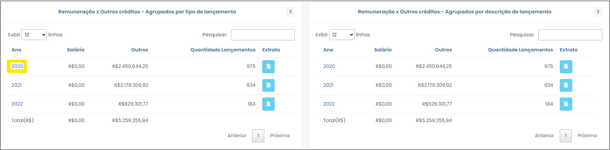

# Movimentações por Investigado

 

Esta opção elenca os investigados por nome e CPF/CNPJ, mostrando os totais de crédito, débito, outros e a quantidade de lançamentos que compõem o somatório de valores demostrado. Trata-se do botão que dá acesso à navegação dos dados de cada um dos investigados.
 

#### Gráfico "Movimentações dos Investigados"
 
*Figura x - Gráfico "Movimentações dos Investigado"*.  

O gráfico "Movimentações dos Investigados" ilustra os valores referentes ao total de créditos e de débitos dos 10 principais investigados do caso. Clicando no ícone destacado em amarelo (Figura x), é possível exportar toda a consulta para uma planilha do Excel, onde será admitida maior manipulação dos dados para fins de análise. 
 

Informações gerais de todos os investigados também são listadas na tabela logo abaixo do gráfico (Figura x). É facultado ao usuário reordenar as informações presentes na tabela, clicando nos títulos das colunas da tabela.
 

 
*Figura x - Tabela "Investigados"*.  

 Ao clicar nas barras do gráfico ou no CPF/CNPJ (primeira coluna da tabela) de algum dos investigados , o usuário será redirecionado para a tela específica do investigado em questão. 
 

#### Barra de Ferramentas do Investigado

 A barra de ferramentas do investigado é composta das seguintes funcionalidades: <strong>"Contas", "Volume Financeiro", "Proventos", "Movimentações entre Investigados", "Depositantes", "Beneficiários", "Créditos", "Débitos", "Vínculos a Crédito e Débito", "Movimentações Atípicas", "Extrato".</strong> Cada função tem um ícone específico, conforme se observa na figura abaixo (Figura x). 

 
*Figura x - Barra de Ferramentas do Investigado*.  

##### Contas 

Nesta opção os dados são organizados por critério de contas, apresentados em forma de gráfico e tabela. Nesta ferramenta pode-se verificar a identificação da agência, tipo de conta, total de crédito e débito, bem como quantidade de movimentações. 

Os dados de movimentações trazem conclusões de grande relevância ao contexto da análise. Por exemplo, se o investigado apresenta créditos que totalizaram R$ 100 mil e quantidade de movimentação igual a dois, em número, conclui-se que esse investigado recebeu em sua conta bancária expressivos valores aglomerados em poucos lançamentos. Esse fato desperta sinais de alerta, quanto a origem do dinheiro transacionado. 

Ao clicar no ícone de extrato, apontado na Figura x, o usuário migrará para outra tela, onde os lançamentos concernentes à consulta selecionada serão exibidos na forma de extrato. 

 
*Figura x - Extrato*.  

##### Volume Financeiro  
#####  Proventos 

Ao clicar neste ícone, o sistema retornará os lançamentos a título de remuneração/proventos/salário, assim identificados pelas instituições financeiras, em comparação aos demais créditos.

Estes lançamentos encontram-se compilados por critério de tipo de lançamento ou descrição, bem como discriminados por ano. Ao clicar em cada ano, será possível visualizar, na nova janela que será aberta, os valores totais lançados mensalmente naquele respectivo ano (Figura x). Além disso, também é possível visualizar com detalhes cada lançamentos realizados em cada mês.

 
*Figura x - Lançamentos por ano*.  

 O usuário é capaz de exportar para o Excel todas as consultas realizadas, incluindo os gráficos. Para isso, basta clicar no botão , conforme a Figura x a seguir.

 
*Figura x - Exportar para Excel*.  

##### Movimentações entre Investigados  
##### Depositantes  
##### Beneficiários  
##### Créditos   
#####  Débitos 
##### Vínculos a Crédito e Débito  
##### Movimentações Atípicas  
##### Extrato  

