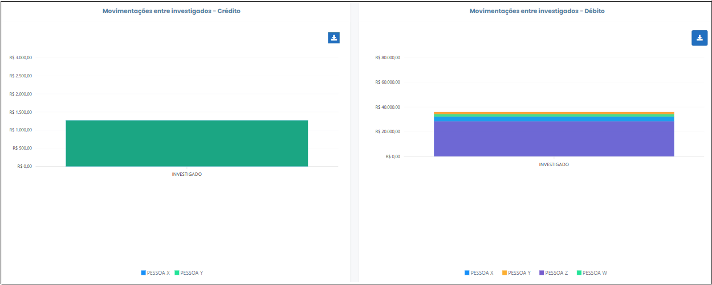
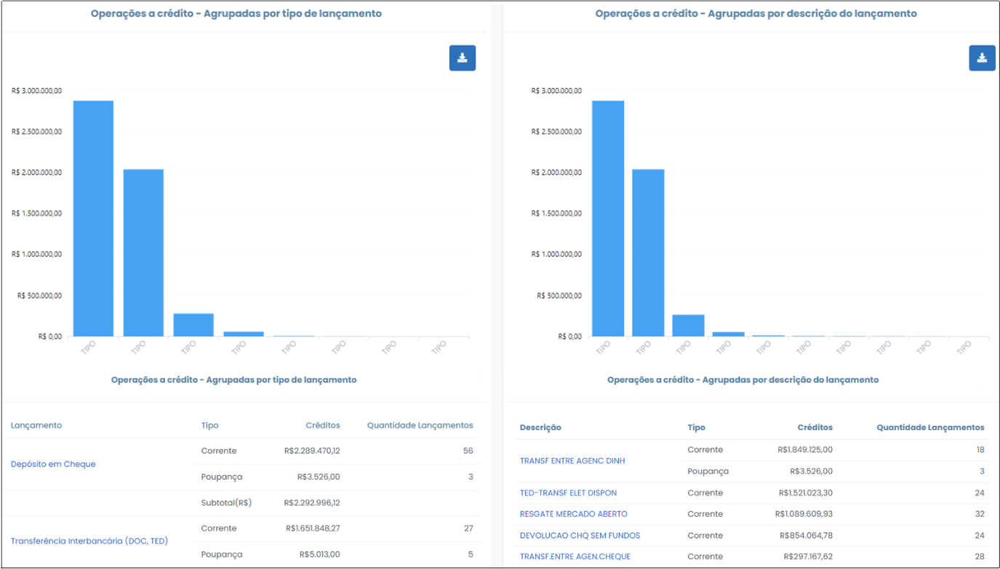
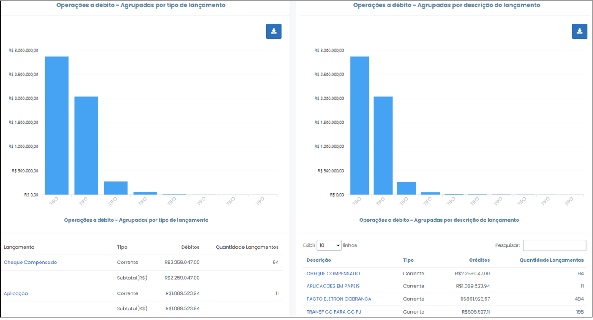

# Movimentações por Investigado

 

Esta opção elenca os investigados por nome e CPF/CNPJ, mostrando os totais de crédito, débito, outros e a quantidade de lançamentos que compõem o somatório de valores demostrado. Trata-se do botão que dá acesso à navegação dos dados de cada um dos investigados.
 

#### Gráfico "Movimentações dos Investigados"
 
*Figura x - Gráfico "Movimentações dos Investigado"*.  

O gráfico "Movimentações dos Investigados" ilustra os valores referentes ao total de créditos e de débitos dos 10 principais investigados do caso. Clicando no ícone destacado em amarelo (Figura x), é possível exportar toda a consulta para uma planilha do Excel, onde será admitida maior manipulação dos dados para fins de análise. 
 

Informações gerais de todos os investigados também são listadas na tabela logo abaixo do gráfico (Figura x). É facultado ao usuário reordenar as informações presentes na tabela, clicando nos títulos das colunas da tabela.
 

 
*Figura x - Tabela "Investigados"*.  

 Ao clicar nas barras do gráfico ou no CPF/CNPJ (primeira coluna da tabela) de algum dos investigados , o usuário será redirecionado para a tela específica do investigado em questão. 
 

#### Barra de Ferramentas do Investigado

 A barra de ferramentas do investigado é composta das seguintes funcionalidades: <strong>"Contas", "Volume Financeiro", "Proventos", "Movimentações entre Investigados", "Depositantes", "Beneficiários", "Créditos", "Débitos", "Vínculos a Crédito e Débito", "Movimentações Atípicas", "Extrato".</strong> Cada função tem um ícone específico, conforme se observa na figura abaixo (Figura x). 

 
*Figura x - Barra de Ferramentas do Investigado*.  

##### Contas 

Nesta opção os dados são organizados por critério de contas, apresentados em forma de gráfico e tabela. Nesta ferramenta pode-se verificar a identificação da agência, tipo de conta, total de crédito e débito, bem como quantidade de movimentações. 

Os dados de movimentações trazem conclusões de grande relevância ao contexto da análise. Por exemplo, se o investigado apresenta créditos que totalizaram R$ 100 mil e quantidade de movimentação igual a dois, em número, conclui-se que esse investigado recebeu em sua conta bancária expressivos valores aglomerados em poucos lançamentos. Esse fato desperta sinais de alerta, quanto a origem do dinheiro transacionado. 

Ao clicar no ícone de extrato, apontado na Figura x, o usuário migrará para outra tela, onde os lançamentos concernentes à consulta selecionada serão exibidos na forma de extrato. 

 
*Figura x - Acessar Extrato*.  

##### Volume Financeiro  

Esse botão apresenta os montates dos créditos e dos débitos efetuados nas contas do investigado ao longo do período de quebra de sigilo, discriminados por critério anual, com botão para consulta do extrato , como mostra a figura x a seguir. 

 
*Figura x - Tela "Volume Financeiro"*.  

Pode-se ainda verificar o volume financeiro em cada mês, clicando no gráfico na área concernente ao ano desejado.

#####  Proventos 

Ao clicar neste ícone, o sistema retornará os lançamentos a título de remuneração/proventos/salário, assim identificados pelas instituições financeiras, em comparação aos demais créditos.

Estes lançamentos encontram-se compilados por critério de tipo de lançamento ou descrição, bem como discriminados por ano. Ao clicar em cada ano, será possível visualizar, na nova janela que será aberta, os valores totais lançados mensalmente naquele respectivo ano. Além disso, também é possível visualizar os detalhes de cada lançamento individualmente, em forma de extrato.    A figura a seguir ilustra essa sequência de detalhamento: 

.png) 
*Figura x - Detalhamento de Proventos*.  

 O usuário é capaz de exportar para o Excel todas as consultas realizadas, incluindo os gráficos. Para isso, basta clicar no botão , conforme a Figura x a seguir.

 
*Figura x - Exportar para Excel*.  

##### Movimentações entre Investigados  

Este botão retorna os valores de operações a débito e a crédito do investigado previamente selecionado com demais investigados do caso. A tabela apresenta identificação do investigado, os valores transacionados e a quantidade de lançamentos. O CPF/CNPJ possui link para consulta do detalhamento dos lançamentos, por intermédio de consulta ao extrato. Os dados também são apresentados em  gráficos, conforme figura x a seguir. 

Salienta-se que somente retornarão as transações que foram devidamente identificadas pelas instituições financeiras.

 
*Figura x - Gráficos Movimentações Entre Investigados*.  

##### Depositantes  

Este botão apresenta as informações bancárias catalogadas por DEPOSITANTES, agrupadas por CPF/CNPJ ou por NOME. É possível consultar o detalhamento dos lançamentos relacionados ao envolvido clicando nos CPF/CNPJ ou nas barras dos gráficos, como ilustrado na Figura x abaixo.

 
*Figura x - Detalhamento Depositantes*.  

##### Beneficiários  

Este botão apresenta as informações bancárias catalogadas por BENEFICIÁRIOS, agrupadas por CPF/CNPJ ou por NOME. É possível consultar o detalhamento dos lançamentos relacionados ao envolvido clicando nos CPF/CNPJ ou nas barras dos gráficos, como ilustrado na Figura x abaixo.

 
*Figura x - Detalhamento Beneficiários*.  

##### Créditos   

Este botão retorna os lançamentos a CRÉDITO, compilados por tipo ou descrição (Figura x). O tipo de lançamento revela a procedência do crédito, se foi depósito ou
transferência bancária, por exemplo. A descrição, por sua vez, oferece detalhamento ainda maior da origem do lançamento, visto que aponta se o depósito foi em dinheiro ou em cheque.

 
*Figura x - Gráfico "Créditos"*.  

#####  Débitos 

Este botão retorna os lançamentos a DÉBITO, compilados por tipo ou descrição. O tipo de lançamento revela a procedência do debito, se foi depósito ou transferência bancária, por exemplo. A descrição, por sua vez, oferece detalhamento ainda maior da origem do lançamento, visto que aponta se o depósito foi em dinheiro ou em cheque.

 
*Figura x - Gráfico "Débitos"*.  

##### Vínculos a Crédito e Débito  

Nesta opção é possível verificar quais valores foram transacionados a crédito e a débito com uma ou mais pessoa física ou jurídica, investigadas ou não. Ou seja, demonstra vínculos entre o investigado e envolvidos, que foram ao mesmo tempo depositantes e beneficiários. As informações encontram-se organizadas por critério de CPF/CNPJ, cujo link redireciona o usuário para o extrato, que contém detalhamento dos lançamentos relativos ao envolvido selecionado, conforme apontado na Figura x abaixo.

 
*Figura x - Depositantes e Beneficiários*.  

##### Movimentações Atípicas  

Este botão exibe os lançamentos de maior volume financeiro, bem como os valores que se repetiram no extrato bancário, apresentados em forma de tabela, que contém a identificação do envolvido (Nome e CNPJ), ano e mês, bem como a natureza do valor, se débito ou crédito. Conforme se observa na figura abaixo, o gráfico expressa os lançamentos atípicos por meio de símbolos, cujos atalhos redirecionam o usuário para outra tela, que contém outro gráfico e tabela que apresentam todos os lançamentos semelhantes àquele selecionado inicialmente. 

 
*Figura x - Gráfico de Movimentações Atípicas*.  

O campo CPF/CNPJ é disposto em forma de link para redirecionamento, mediante o qual será possível consultar o extrato de todos os lançamentos do envolvido e do investigado em questão, conforme apontado na Figura x, acima. 
>

##### Extrato  

A partir dessa opção, é possível visualizar todos os extratos aglutinados em uma única planilha, a qual compreende todas as transações do investigado, conforme ilustrado na Figura x, a seguir. É possível exportar a planilha para Excel clicando no botão .
>

 
*Figura x - Extrato*.  

