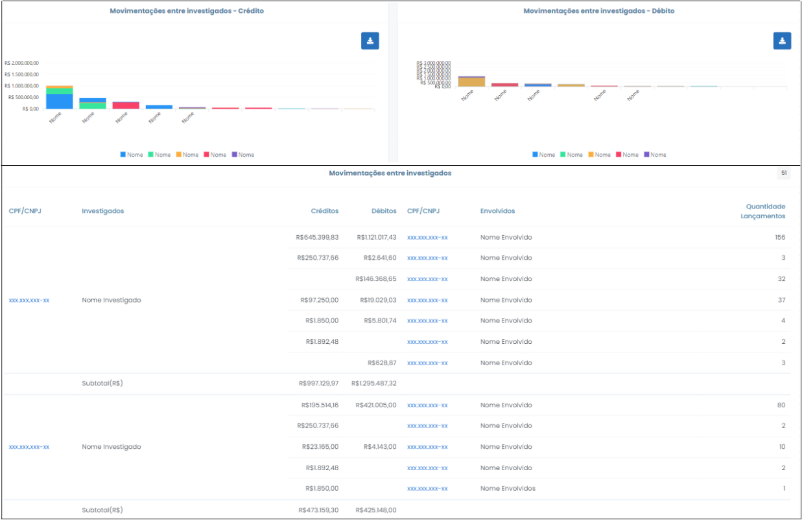

# Movimentações entre Investigados

 

Esta opção retorna as movimentações financeiras transacionadas a crédito e a débito, bem como a quantidade de lançamentos entre os investigados do caso. As informações são apresentadas em forma de gráfico e tabela, conforme indicado na Figura x abaixo.

 
*Figura x - Tela "Movimentações entre Investigado"*.   

Ao clicar nas opções do gráfico o sistema trará informações pormenorizadas das operações realizadas pelo investigado selecionado com os demais investigados do caso, retornando os dados em forma de gráfico e tabela. Ao clicar no CPF/CNPJ do investigado (primeira coluna na tabela da Figura x) o usuário será redirecionado 
para extrato correspondente à operação selecionada.

Ressalva-se que apenas retornarão lançamentos devidamente identificados pelas instituições financeiras. Isso posto, elucida-se que esta funcionalidade não esgota todas as transações havidas entre os investigados, posto que podem existir algumas que não estejam identificadas adequadamente pelas instituições bancárias, de modo que o analista deve esgotar a busca explorando outras ferramentas do sistema, inclusive com eventual verificação individual das contas de cada investigado. De todo modo, nesta opção já se catalogam, se não todas, muitas transações feitas, o que já pode indicar ou afastar fatos suspeitos. 

