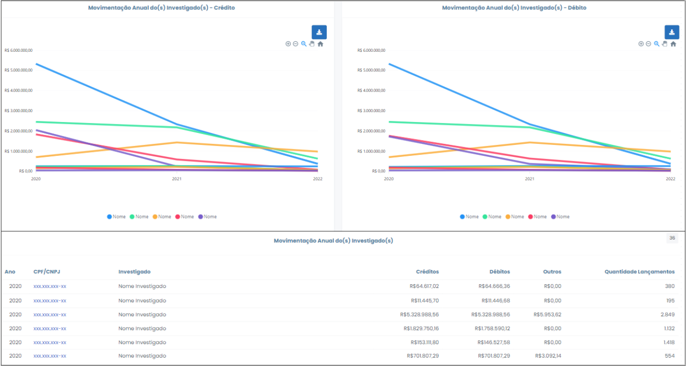

# Movimentações Anuais dos Investigados

 

Esta opção apresenta as movimentações anuais a crédito e a débito, bem como a quantidade de lançamentos de cada investigado. Os dados são organizados em forma de gráfico e tabela, consoante Figura 25, abaixo. É possível exportar toda a consulta para uma planilha do Excel, onde será admitida maior manipulação dos dados para fins de análise, clicando no ícone  .
 

 
*Figura 25 - Tela "Movimentações Anuais dos Investigados"*.   

Esta opção possui imensa importância para se observar a movimentação financeira dos investigados ao longo de cada ano, com o fim de se realizar o cotejo com a sua evolução patrimonial (dados fiscais) ou com determinada contratação com a administração militar ocorrida no período analisado, por exemplo.

As informações podem ser pormenorizadas mediante clique nas opções do gráfico ou no CPF/CNPJ do investigado (segunda coluna na tabela).

Ao clicar em determinado CPF/CNPJ, referente ao ano de 2020, por exemplo, o usuário será redirecionado para o extrato do investigado, onde poderá obter informações minuciosas relativas às movimentações do ano selecionado

