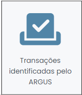
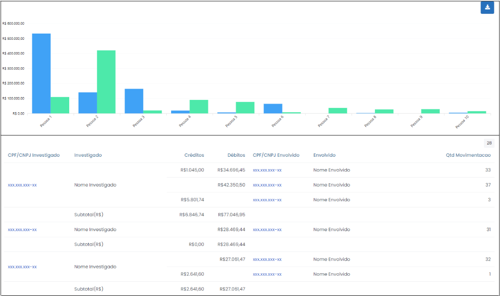
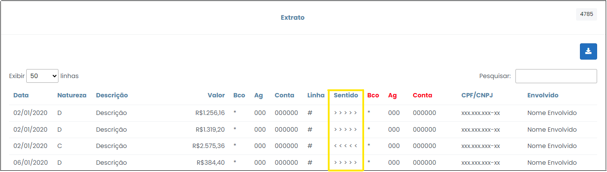

# Transações Identificadas pelo ARGUS

 

Esta opção retorna as movimentações financeiras transacionadas a crédito e a débito, entre investigados e envolvidos na investigação que foram identificadas pelo Argus. As informações são apresentadas em forma de gráfico e tabela, conforme indicado na Figura 26, abaixo. É possível exportar toda a consulta para uma planilha do Excel, onde será admitida maior manipulação dos dados para fins de análise, clicando no ícone  .

 
*Figura 26 - Tela "Transações Identificadas pelo Argus"*.  

O Argus realiza uma pesquisa, por toda a extensão do caso, dos dados bancários relativos a lançamentos a priori não identificados. Ou seja, efetua o cruzamento das informações, como banco, agência e conta, dos lançamentos de origem desconhecida com os dados disponíveis no sistema, com o fim de revelar a quem pertence aqueles
dados, e, por conseguinte, identificar os responsáveis pelas movimentações.

Esta opção possui grande relevância no contexto da investigação, na medida em que propicia identificar operações que não foram originalmente reconhecidas pelas instituições financeiras, sendo possível desse modo, detectar-se vínculos inicialmente não revelados.

Ao clicar nas opções do gráfico ou no CPF/CNPJ do investigado (primeira coluna na tabela) o usuário será redirecionado para extrato de movimentações identificadas pelo Argus, conforme Figura 27. Nessa tela serão apresentadas informações como data e valor da operação, envolvidos identificados e o sentido da transação, que indica de qual conta o valor sai e para qual conta ele vai, onde:  

<ul>
<li><strong>Sentido >>> </strong> : Indica que o valor sai da conta à esquerda e chega na conta à direita (débito).</ol>
<li><strong>Sentido <<< </strong> : Indica que o valor sai da conta à direita e chega na conta à esquerda (crédito).</ol>
</ul>

 
*Figura 27 - Extrato de movimentações identificadas pelo Argus*.  

