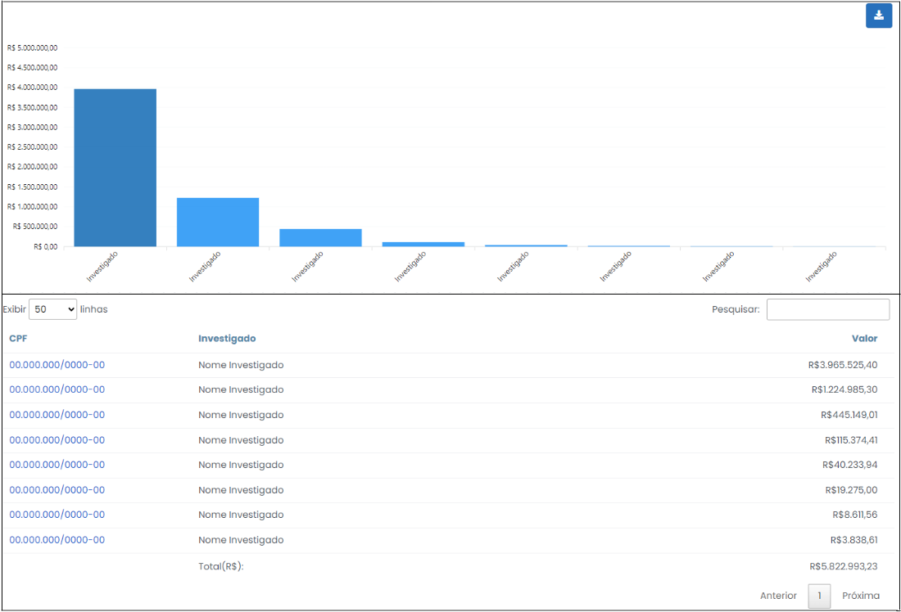

# Depósitos Bloqueados

 

Esta opção concatena os créditos não identificados, relativos a depósitos, com os dados bancários apontados nos depósitos bloqueados, o que torna possível constatar depositantes, a priori, não identificados. As informações são apresentadas em forma de gráfico e tabela, conforme indicado na Figura 28, a seguir. É possível exportar toda a consulta para uma planilha do Excel, onde será admitida maior manipulação dos dados para fins de análise, clicando no ícone  .

 
*Figura 28 - Tela "Depósitos Bloqueados"*.  

Ao realizar um crédito em uma conta bancária, normalmente por meio de depósito em cheque, a quantia passa por um procedimento de conferência do próprio banco, que se certifica da correspondência dos valores e se há fundos disponíveis na conta do depositante. Por exemplo, caso seja efetuado um depósito em cheque, a instituição financeira procederá uma averiguação detalhada do lastro da conta de origem, o que necessariamente a fará conhecer as informações de banco, agência e conta de quem depositou. Se tudo estiver correto, a instituição libera o pagamento ao beneficiário. Durante esse processo, o dinheiro fica reconhecido no extrato bancário como depósito bloqueado.

Nesse contexto, o Argus correlaciona os lançamentos a crédito não identificados, concernentes a depósitos, das contas do investigado com as informações disponíveis nos depósitos bloqueados, com o intuito de desvelar a fonte do recurso depositado.

Ao clicar nas colunas do gráfico ou no CPF/CNPJ do investigado (primeira coluna na tabela), ambos em forma de link para redirecionamento, o usuário será redirecionado para o extrato dos depósitos bloqueados, consoante Figura 29, abaixo. 

 
*Figura 29 - Extrato dos Depósitos Bloqueados*.  

Assim, é possível que se identifique a procedência de determinado depósito exposto na lista de depositantes como “não identificado”, mediante análise do extrato dos depósitos bloqueados, o qual contém detalhamento das informações das contas bancárias concernentes a transação analisada.

