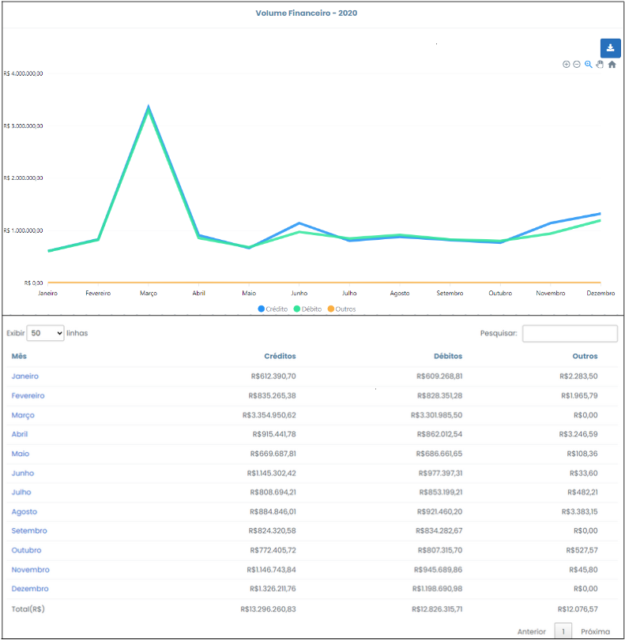
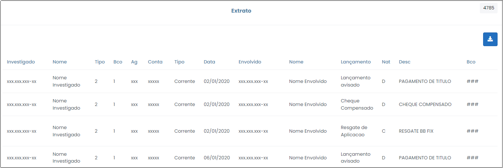

# Volume Financeiro

 

Esse botão mostra um panorama geral dos créditos e dos débitos ao longo do período de quebra de sigilo, trata-se do somatório do volume financeiro movimentado por todos investigados por ano. As informações serão apresentadas em forma de gráfico e tabela, conforme Figura 31, abaixo. É possível exportar toda a consulta para uma planilha do Excel, onde será admitida maior manipulação dos dados para fins de análise, clicando no ícone  .

 
*Figura 31 - Tela "Volume financeiro"*.  

De maneira análoga às <a href="../Página06/">"Movimentações Anuais dos Investigados"</a>, esta opção também guarda relevância significativa, dado que proporciona informações relativas à representatividade de cada investigado frente às movimentações do período. Essas informações fornecem subsídios para que se realize o cotejo entre evolução patrimonial (dados fiscais) dos investigados e o volume financeiro do mesmo período, bem como permite analisar se o volume financeiro apresentou crescimento abrupto no mesmo período em que se consumou determinada contratação no âmbito da Administração Militar, por exemplo. 

Ao clicar nas opções do gráfico o sistema trará informações pormenorizadas das operações a crédito e a débito dentro do ano selecionado, organizadas consoante Figura 32, abaixo. Nesse exemplo, o ano selecionado foi o de 2020. 

 
*Figura 32 - Gráfico "Volume Financeiro".*  

Ao clicar em algum dos meses referente ao ano de 2020, por exemplo, o usuário será redirecionado para o extrato, onde poderá obter informações minuciosas relativas às movimentações do mês selecionado, conforme Figura 33, abaixo. 

 
*Figura 33 - Extrato mensal Volume Financeiro*.  