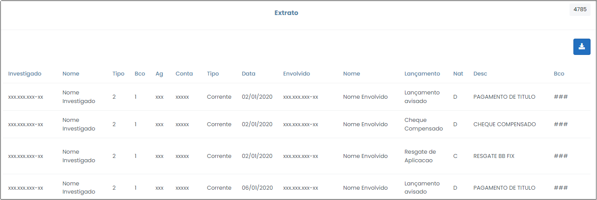

# Movimentações Atípicas

 

Esta opção apresenta todas as movimentações consideradas atípicas pelo sistema do caso como um todo. As informações são apresentadas em forma de gráfico e tabela, conforme indicado na Figura x, abaixo.

 
*Figura x - Movimentações Atípicas*.  

Esta opção possui imensa importância no contexto da investigação, na medida em que aponta as operações que se sobressaem das demais em razão de seu valor e do número de vezes que se repetem. 

De acordo com o que se verifica na figura acima, o gráfico expressa os lançamentos atípicos por meio de símbolos, onde cada símbolo representa um lançamento. Ao clicar nos atalhos contidos no gráfico, o usuário será redirecionado para outra tela, que exibirá outro gráfico e tabela que apresentarão os lançamentos semelhantes aquele selecionado inicialmente.

A tabela exibe informações relativas aos investigados e aos envolvidos, sendo segregadas por mês e ano; por natureza (se crédito ou débito) e por valor. Assim, por meio desse menu, o analista pode detectar padrões de depósitos ou de saques, por exemplo. 

Ao clicar no CPF/CNPJ do investigado (primeira coluna da tabela da Figura x), o usuário será redirecionado para a tela que conterá o extrato geral desse investigado (Figura x), ou seja, aquele que contém toda a movimentação do período de quebra de sigilo. Em paralelo, ao clicar no CPF/CNPJ da terceira coluna dessa tabela, será possível verificar o total de créditos correspondentes a este CPF/CNPJ, frente aos créditos do investigado identificado no CPF/CNPJ da primeira coluna. 

 
*Figura x - Movimentações Atípicas (detalhamento extrato mensal)*.  