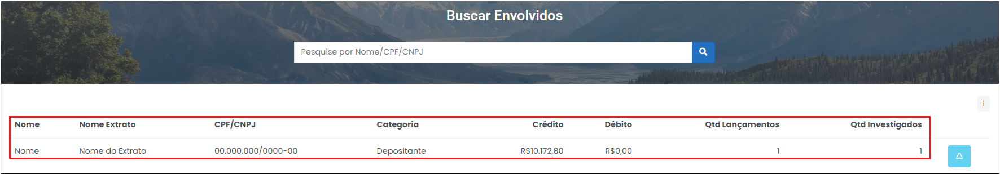
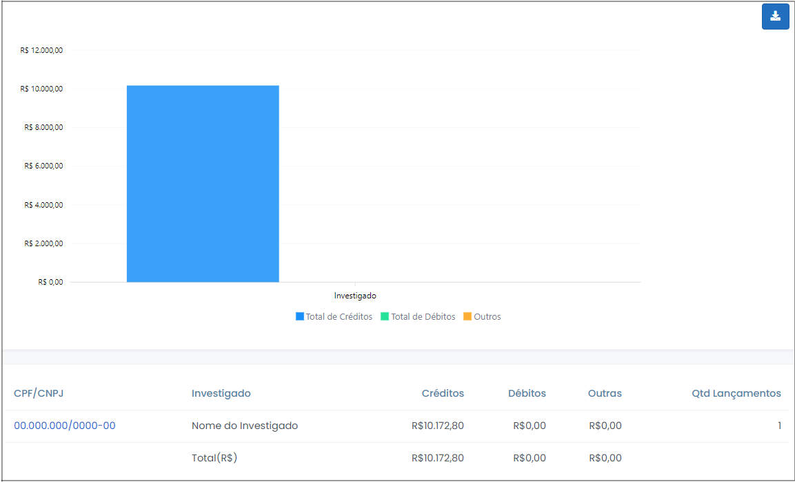

# Transações por Envolvidos

 

Esta opção possibilita a pesquisa de envolvidos, por nome, por CPF/CNPJ ou, até mesmo, por parte desses dados, no âmbito de determinado caso, conforme ilustração da Figura x, abaixo.

 
*Figura x - Buscar Envolvidos*.  

Esta opção possui grande relevância no contexto da investigação, uma vez que possibilita identificar os vínculos financeiros de determinada pessoa física ou jurídica, manteve com os investigados do caso. 

Desse modo, ao digitar o nome de determinada pessoa (ou parte dele) no campo “Nome, CPF ou CNPJ” e clicar na lupa , o Argus promoverá uma varredura por toda a extensão da base de dados disponível do caso em questão e apontará as operações identificadas realizadas por pessoas que possuem o atributo pesquisado com os investigados do caso.

Os registros encontrados serão exibidos em forma de tabela, que apontará a identificação completa da pessoa pesquisada, se foi depositante ou beneficiária, os valores a crédito e a débito transacionados, as quantidades de lançamentos e de investigados detectados na pesquisa, conforme destacado em vermelho na Figura x, acima. 

Ao clicar o ícone , localizado na última coluna da tabela destacada acima, pode-se verificar de maneira pormenorizada os vínculos constatados pelo sistema, consoante Figura x, abaixo. 

 
*Figura x - Transações por envolvido (detalhamento)*.  

Conforme depreende-se da figura acima, os dados serão apresentados em forma de gráfico e tabela.

Ao clicar nas opções do gráfico, o usuário será redirecionado para outra tela, que exibirá outro gráfico e tabela, onde serão apontados os lançamentos concernentes ao investigado/envolvido selecionado.

Na tabela apresentada, as opções CPF/CNPJ, crédito e débito serão exibidas em forma de atalho, por meio dos quais o usuário migrará para uma tela, onde os lançamentos referentes à consulta selecionada serão exibidos na forma de extrato, conforme Figura x a seguir.

 
*Figura x - Transações por envolvido (extrato)*.  