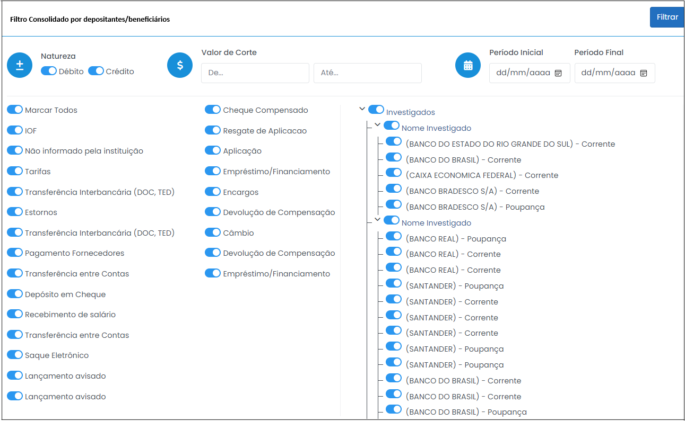
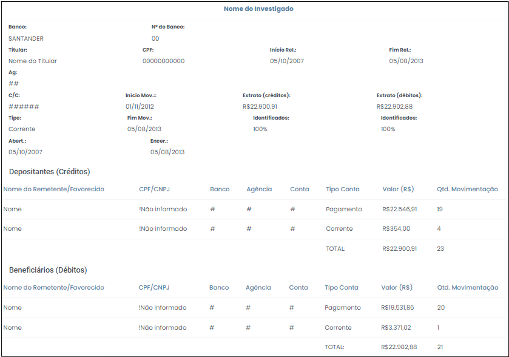
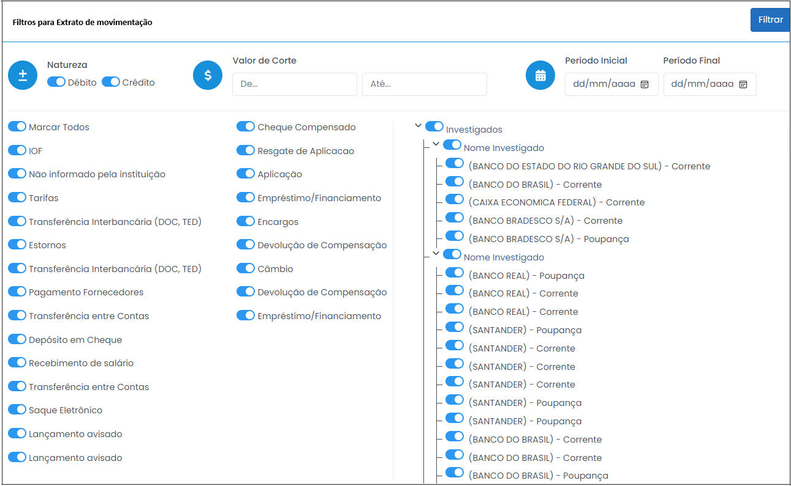
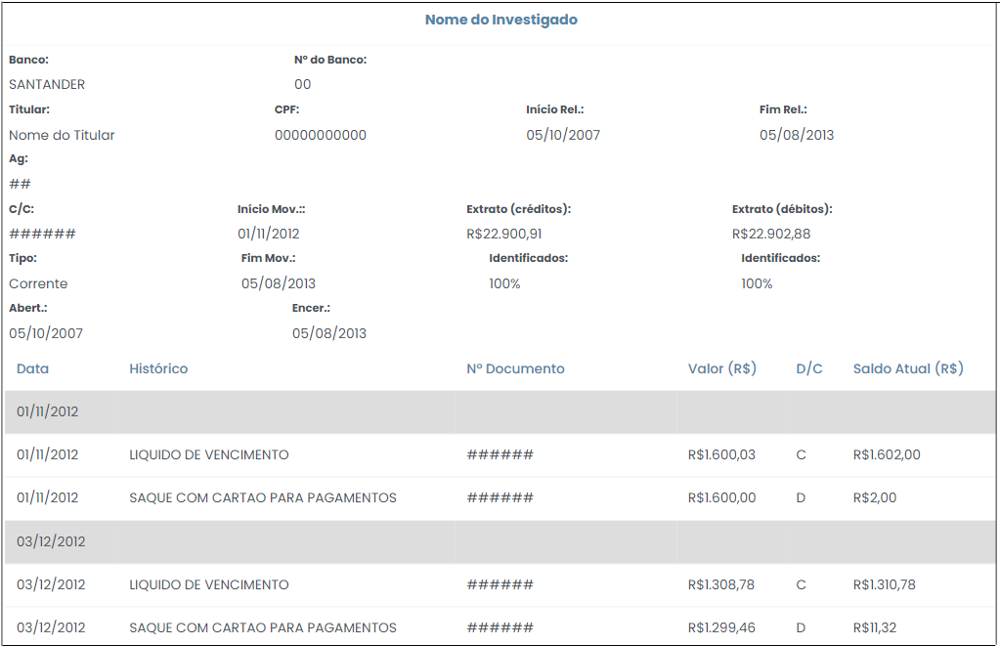
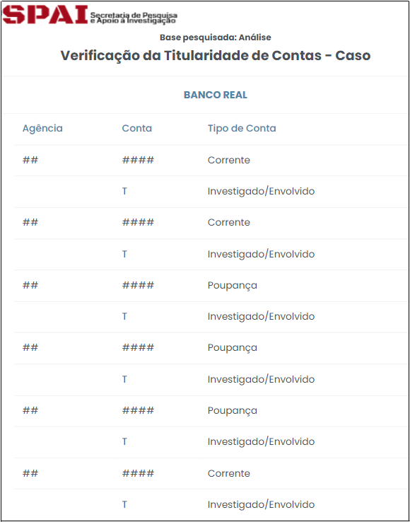

# Relatórios SIMBA

 

Esta opção disponibiliza os relatórios gerados automaticamente pelo sistema SIMBA relativos aos dados bancários.

## Tela Inicial 

A tela inicial apresenta uma relação de todos os atendimentos disponíveis para consulta, já selecionados automaticamente. Caso não necessite da verificação de algum dos atendimentos selecionados, basta clicar no botão , que deve assumir a forma .

No lado direito da tela, encontra-se a tabela "Modelos de relatório", a qual elenca os sete relatórios SIMBA, disponibilizados por meio de links, conforme destacado na Figura 40, a seguir. 

 
  
*Figura 40 - Relatórios SIMBA*.   

#### Contas investigadas

Esse relatório apresenta o número de contas investigadas, referente ao respectivo caso analisado pelo usuário. Os dados são organizados em forma de tabela, que discrimina o número de contas por banco e por tipo de conta, consoante Figura 41, a seguir.

 
*Figura 41 - Relatório de Contas Investigadas*.   

#### Detalhamento de contas por investigado

Este relatório apresenta o detalhamento das contas de todos os investigados. Revela informações como tipo de conta, se corrente, poupança ou investimento; início e final do relacionamento bancário, bem como especificação quanto à titularidade, se co-titular ou representante legal, por exemplo. 

Esta opção possui grande relevância no contexto da investigação, na medida em que se considera substancial que o usuário tenha conhecimento das exatas relações de titularidade das contas analisadas. Isso porque se dois investigados possuem co-titularidade de contas, tal duplicidade deve ser excluída da análise, por meio do uso dos filtros, visando a obtenção de dados fidedignos.

A Figura 42, abaixo, ilustra a título de exemplo como o referido relatório é apresentado pelo sistema.

 
*Figura 42 - Extrato de contas por investigado*.   

#### Extrato consolidado por histórico 

Ao clicar nesta opção o sistema exibirá uma tela contendo alternativas de filtro, conforme Figura 43, para que se possa gerar o relatório conforme a conveniência de cada investigação. 

 
*Figura 43 - Filtros para Extrato consolidado por histórico*.  

Dentre as opções de filtro, pode-se escolher a natureza do lançamento, crédito ou débito; sobre qual investigado se deseja gerar o relatório ou ainda a conta específica, considerando determinado investigado. As opções de filtro ativo permanecem na cor azul, conforme figura acima.

Ao clicar no ícone  no lado esquerdo do nome de cada investigado ou conta, pode-se ocultar ou expandir o detalhamento dos dados.

Ao escolher as opções de filtro e clicar no botão , no canto direito da tela, o sistema retornará um relatório nos moldes da Figura 44, a seguir. 

 
*Figura 44 - Extrato consolidado por histórico*.  

A perspectiva do relatório chamado "Extrato consolidado por histórico" é demonstrar o quanto cada tipo de lançamento impactou determinada conta. Conforme se observa na figura acima, o relatório em questão apresenta informações pormenorizadas de determinada conta, segregando os lançamentos por natureza, débitos e créditos. Dentro de cada natureza os lançamentos são agrupados por tipo, se transferências de crédito ou depósito online, por exemplo. O relatório demonstra ainda o valor dos tipos de lançamento, bem como a representatividade percentual desse valor frente ao total de créditos da conta, juntamente com a quantidade de lançamentos. 

#### Extrato Detalhado 

Esse relatório funciona de maneira semelhante ao relatório <a href="../Página16/#extrato-consolidado-por-historico">"Extrato consolidado por histórico" </a>. 

Ao clicar nesta opção o sistema exibirá uma tela contendo alternativas de filtro, conforme Figura 45, para que se possa gerar o relatório conforme a conveniência de cada investigação. 

 
*Figura 45 - Filtros para Extrato Detalhado*.  

Dentre as opções de filtro, pode-se escolher a natureza do lançamento, crédito ou débito; sobre qual investigado se deseja gerar o relatório ou ainda a conta específica, considerando determinado investigado. As opções de filtro ativo permanecem na cor azul, conforme figura acima.

Ao clicar no ícone  no lado esquerdo do nome de cada investigado ou conta, pode-se ocultar ou expandir o detalhamento dos dados.

Ao escolher as opções de filtro e clicar no botão , no canto direito da tela, o sistema retornará um relatório nos moldes da Figura 46, a seguir. 

 
*Figura 46 - Extrato detalhado*.  

Conforme se verifica, o Extrato Detalhado possibilita consulta pormenorizada da movimentação de determinada conta, por meio do qual se constata minúcias, tais como data e tipo de lançamento; se o valor foi debitado ou creditado; identificação do depositante/beneficiário; além da observação do lançamento. 

#### Consolidado por depositantes / beneficiários

Ao clicar nesta opção o sistema exibirá uma tela contendo alternativas de filtro, conforme Figura 47, para que se possa gerar o relatório conforme a conveniência de cada investigação.

 
*Figura 47 - Filtros para Consolidação por depositantes/beneficiários*.  

Dentre as opções de filtro, pode-se escolher a natureza do lançamento, crédito ou débito; sobre qual investigado se deseja gerar o relatório ou ainda a conta específica, considerando determinado investigado. As opções de filtro ativo permanecem na cor azul, conforme figura acima.

Ao clicar no ícone  no lado esquerdo do nome de cada investigado ou conta, pode-se ocultar ou expandir o detalhamento dos dados.

Ao escolher as opções de filtro e clicar no botão , no canto direito da tela, o sistema retornará um relatório nos moldes da Figura 48, a seguir. 

 
*Figura 48 - Extrato consolidado por depositantes/beneficiários*.   

#### Extrato de movimentação

Ao clicar nesta opção o sistema exibirá uma tela contendo alternativas de filtro, conforme Figura 49, para que se possa gerar o relatório conforme a conveniência de cada investigação.

 
*Figura 49 - Filtros para Extrato de movimentação*.  

Dentre as opções de filtro, pode-se escolher a natureza do lançamento, crédito ou débito; sobre qual investigado se deseja gerar o relatório ou ainda a conta específica, considerando determinado investigado. As opções de filtro ativo permanecem na cor azul, conforme figura acima.

Ao clicar no ícone  no lado esquerdo do nome de cada investigado ou conta, pode-se ocultar ou expandir o detalhamento dos dados.

Ao escolher as opções de filtro e clicar no botão , no canto direito da tela, o sistema retornará um relatório nos moldes da Figura 50, a seguir. 

 
*Figura 50 - Extrato de movimentação*.  

Consoante se observa, o relatório "Extrato de Movimentação" tem como foco o exame movimentação de determinada conta. Assim, a tabela, por meio da qual se organiza os dados, apresenta a coluna “Saldo Atual (R$)”. Por intermédio dessa coluna pode-se averiguar a memória de saldos de determinada conta a partir da data limite da quebra de sigilo bancário.

Dessa forma, é possível entender quais tipos de lançamento colaboraram para que determinada conta apresente saldo final quarenta vezes maior do que o inicial em certo intervalo de tempo, por exemplo, bastando para isso confrontar os créditos e os débitos com o saldo da conta.

Ademais, o relatório apresenta dados como data, histórico (tipo de lançamento); nº do documento; valor; e natureza do lançamento, débito ou crédito. 

#### Verificação da titularidade das contas

Ao clicar nesta opção, o usuário poderá examinar o relatório de "Verificação da Titulridade de Contas", estruturado conforme Figura 51, a seguir. 

 
*Figura 51 - Extrato de Verificação da titularidade das contas*.  

Conforme se observa, este relatório elenca as contas investigadas por banco, especificando qual tipo de relacionamento os investigados e/ou envolvidos têm com as respectivas contas. Demonstra ainda detalhamento dos números da agência e da conta, bem como o tipo de conta,
corrente ou investimento, por exemplo.

Constitui-se de grande utilidade no decorrer da análise dos dados bancários, juntamente com o relatório <a href="../Página16/#detalhamento-de-contas-por-investigado">Detalhamento de contas por investigado</a>, em razão da relevância do conhecimento da titularidade das contas investigadas.

