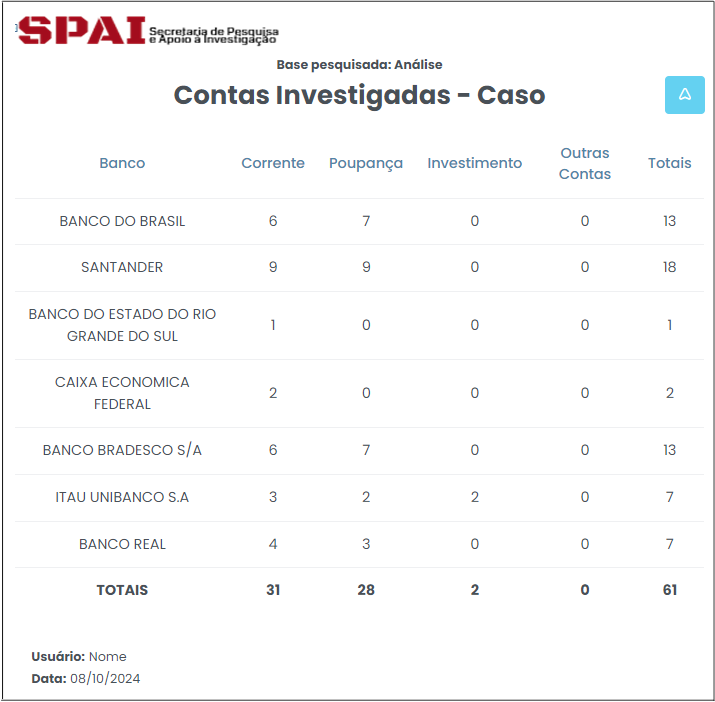
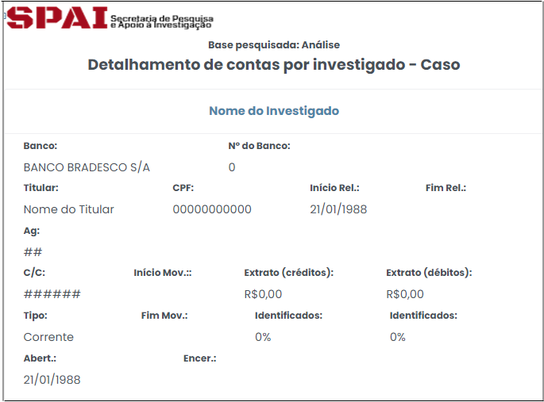
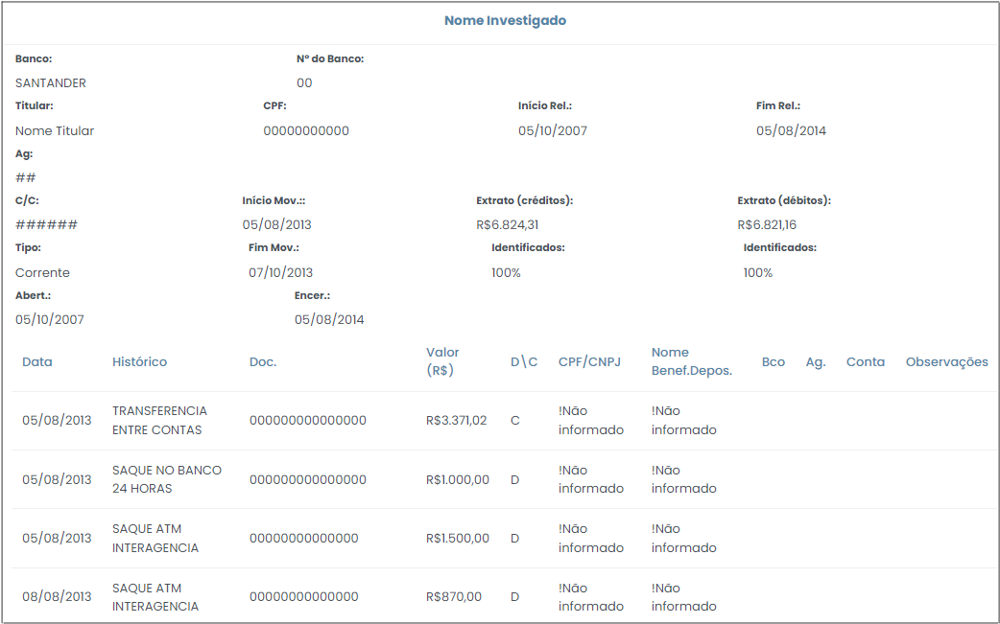

# Relatórios SIMBA

 

Esta opção disponibiliza os relatórios gerados automaticamente pelo sistema SIMBA relativos aos dados bancários.

## Tela Inicial 

A tela inicial apresenta uma relação de todos os atendimentos disponíveis para consulta, já selecionados automaticamente. Caso não necessite da verificação de algum dos atendimentos selecionados, basta clicar no botão , que deve assumir a forma . 

No lado direito da tela, encontra-se a tabela "Modelos de relatório", a qual elenca os sete relatórios SIMBA, disponibilizados por meio de links, conforme destacado na Figura x, a seguir. 
 
  
*Figura x - Relatórios SIMBA (Modelos de Relatório)*.  

#### Contas investigadas
Esse relatório apresenta o número de contas investigadas, referente ao respectivo caso analisado pelo usuário. Os dados são organizados em forma de tabela, que discrimina o número de contas por banco e por tipo de conta, consoante Figura x, a seguir.

 
*Figura x - Relatório de Contas Investigadas*.   

#### Detalhamento de contas por investigado
Este relatório apresenta o detalhamento das contas de todos os investigados. Revela informações como tipo de conta, se corrente, poupança ou investimento; início e final do relacionamento bancário, bem como especificação quanto à titularidade, se co-titular ou representante legal, por exemplo. 

Esta opção possui grande relevância no contexto da investigação, na medida em que se considera substancial que o usuário tenha conhecimento das exatas relações de titularidade das contas analisadas. Isso porque se dois investigados possuem co-titularidade de contas, tal duplicidade deve ser excluída da análise, por meio do uso dos filtros, visando a obtenção de dados fidedignos.

A Figura x, abaixo, ilustra a título de exemplo como o referido relatório é apresentado pelo sistema.

 
*Figura x - Extrato de contas por investigado*.   

#### Extrato consolidado por histórico 
Ao clicar nesta opção o sistema exibirá uma tela contendo alternativas de filtro, conforme Figura x (abaixo), para que se possa gerar o relatório conforme a conveniência de cada investigação. 

 
*Figura x - Filtros para Extrato consolidado por histórico*.   

Dentre as opções de filtro, pode-se escolher a natureza do lançamento, crédito ou débito; sobre qual investigado se deseja gerar o relatório ou ainda a conta específica, considerando determinado investigado. As opções de filtro ativo permanecem na cor azul, conforme figura acima.

Ao clicar no ícone  no lado esquerdo do nome de cada investigado ou conta, pode-se ocultar ou expandir o detalhamento dos dados.

Ao escolher as opções de filtro e clicar no botão , no canto direito da tela, o sistema retornará um relatório nos moldes da Figura x, a seguir. 

 
*Figura x - Extrato consolidado por histórico*.   

A perspectiva do relatório chamado "Extrato consolidado por histórico" é demonstrar o quanto cada tipo de lançamento impactou determinada conta. Conforme se observa na figura acima, o relatório em questão apresenta informações pormenorizadas de determinada conta, segregando os lançamentos por natureza, débitos e créditos. Dentro de cada natureza os lançamentos são agrupados por tipo, se transferências de crédito ou depósito online, por exemplo. O relatório demonstra ainda o valor dos tipos de lançamento, bem como a 
representatividade percentual desse valor frente ao total de créditos da conta, juntamente com a quantidade de lançamentos. 

#### Extrato Detalhado 
Esse relatório funciona de maneira semelhante ao relatório <a href="../Página16/#extrato-consolidado-por-historico">"Extrato consolidado por histórico" </a>. 

Ao clicar nesta opção o sistema exibirá uma tela contendo alternativas de filtro, conforme Figura x (abaixo), para que se possa gerar o relatório conforme a conveniência de cada investigação. 

 
*Figura x - Filtros para Extrato Detalhado*.   

Dentre as opções de filtro, pode-se escolher a natureza do lançamento, crédito ou débito; sobre qual investigado se deseja gerar o relatório ou ainda a conta específica, considerando determinado investigado. As opções de filtro ativo permanecem na cor azul, conforme figura acima.

Ao clicar no ícone  no lado esquerdo do nome de cada investigado ou conta, pode-se ocultar ou expandir o detalhamento dos dados.

Ao escolher as opções de filtro e clicar no botão , no canto direito da tela, o sistema retornará um relatório nos moldes da Figura x, a seguir. 

 
*Figura x - Extrato detalhado*.   
