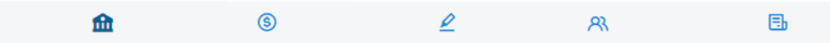

# ARGUS 

Módulo Análise

 
*Figura 1 - Tela do Módulo de Análise.*  

 O Sistema ARGUS – Módulo Análise é voltado para o cruzamento de informações obtidas por meio da quebra de sigilo bancário. Esse módulo auxilia os usuários responsáveis pela análise bancária ao processar dados transmitidos pelo SIMBA, apresentando-os em uma interface intuitiva. Essa simplificação dos dados acelera a análise e torna os procedimentos investigativos mais eficientes. 
 

####  Instrução - grupo de ícones 

 
*Figura x - Grupo de ícones do canto superior esquerdo da tela.*  

Todas as telas do módulo de análise ostentarão, no canto superior esquerdo, este grupo de ícones (Figura x), onde: 

<svg xmlns="http://www.w3.org/2000/svg" height="35px" width="25px" viewBox="0 0 576 512"><!--!Font Awesome Free 6.6.0 by @fontawesome - https://fontawesome.com License - https://fontawesome.com/license/free Copyright 2024 Fonticons, Inc.--><path d="M575.8 255.5c0 18-15 32.1-32 32.1l-32 0 .7 160.2c0 2.7-.2 5.4-.5 8.1l0 16.2c0 22.1-17.9 40-40 40l-16 0c-1.1 0-2.2 0-3.3-.1c-1.4 .1-2.8 .1-4.2 .1L416 512l-24 0c-22.1 0-40-17.9-40-40l0-24 0-64c0-17.7-14.3-32-32-32l-64 0c-17.7 0-32 14.3-32 32l0 64 0 24c0 22.1-17.9 40-40 40l-24 0-31.9 0c-1.5 0-3-.1-4.5-.2c-1.2 .1-2.4 .2-3.6 .2l-16 0c-22.1 0-40-17.9-40-40l0-112c0-.9 0-1.9 .1-2.8l0-69.7-32 0c-18 0-32-14-32-32.1c0-9 3-17 10-24L266.4 8c7-7 15-8 22-8s15 2 21 7L564.8 231.5c8 7 12 15 11 24z"/></svg> Retorna à seleção de gráficos 
 
<svg xmlns="http://www.w3.org/2000/svg" height="35px" width="25px" viewBox="0 0 512 512"><!--!Font Awesome Free 6.6.0 by @fontawesome - https://fontawesome.com License - https://fontawesome.com/license/free Copyright 2024 Fonticons, Inc.--><path d="M459.5 440.6c9.5 7.9 22.8 9.7 34.1 4.4s18.4-16.6 18.4-29l0-320c0-12.4-7.2-23.7-18.4-29s-24.5-3.6-34.1 4.4L288 214.3l0 41.7 0 41.7L459.5 440.6zM256 352l0-96 0-128 0-32c0-12.4-7.2-23.7-18.4-29s-24.5-3.6-34.1 4.4l-192 160C4.2 237.5 0 246.5 0 256s4.2 18.5 11.5 24.6l192 160c9.5 7.9 22.8 9.7 34.1 4.4s18.4-16.6 18.4-29l0-64z"/></svg>  Retorna ao filtro anterior
 
<svg xmlns="http://www.w3.org/2000/svg" height="35px" width="25px" viewBox="0 0 512 512"><!--!Font Awesome Free 6.6.0 by @fontawesome - https://fontawesome.com License - https://fontawesome.com/license/free Copyright 2024 Fonticons, Inc.--><path d="M3.9 54.9C10.5 40.9 24.5 32 40 32l432 0c15.5 0 29.5 8.9 36.1 22.9s4.6 30.5-5.2 42.5L320 320.9 320 448c0 12.1-6.8 23.2-17.7 28.6s-23.8 4.3-33.5-3l-64-48c-8.1-6-12.8-15.5-12.8-25.6l0-79.1L9 97.3C-.7 85.4-2.8 68.8 3.9 54.9z"/></svg> Oculta/exibe filtro. As opções de filtro são:  

 
<ul>
<ol><svg xmlns="http://www.w3.org/2000/svg" height="25px" width="20px" viewBox="0 0 512 512"><!--!Font Awesome Free 6.6.0 by @fontawesome - https://fontawesome.com License - https://fontawesome.com/license/free Copyright 2024 Fonticons, Inc.--><path fill="#1f6da8" d="M243.4 2.6l-224 96c-14 6-21.8 21-18.7 35.8S16.8 160 32 160l0 8c0 13.3 10.7 24 24 24l400 0c13.3 0 24-10.7 24-24l0-8c15.2 0 28.3-10.7 31.3-25.6s-4.8-29.9-18.7-35.8l-224-96c-8-3.4-17.2-3.4-25.2 0zM128 224l-64 0 0 196.3c-.6 .3-1.2 .7-1.8 1.1l-48 32c-11.7 7.8-17 22.4-12.9 35.9S17.9 512 32 512l448 0c14.1 0 26.5-9.2 30.6-22.7s-1.1-28.1-12.9-35.9l-48-32c-.6-.4-1.2-.7-1.8-1.1L448 224l-64 0 0 192-40 0 0-192-64 0 0 192-48 0 0-192-64 0 0 192-40 0 0-192zM256 64a32 32 0 1 1 0 64 32 32 0 1 1 0-64z"/></svg></ol>
<ol><svg xmlns="http://www.w3.org/2000/svg" height="25px" width="25px" viewBox="0 0 512 512"><!--!Font Awesome Free 6.6.0 by @fontawesome - https://fontawesome.com License - https://fontawesome.com/license/free Copyright 2024 Fonticons, Inc.--><path fill="#1f6da8" d="M326.7 403.7c-22.1 8-45.9 12.3-70.7 12.3s-48.7-4.4-70.7-12.3l-.8-.3c-30-11-56.8-28.7-78.6-51.4C70 314.6 48 263.9 48 208C48 93.1 141.1 0 256 0S464 93.1 464 208c0 55.9-22 106.6-57.9 144c-1 1-2 2.1-3 3.1c-21.4 21.4-47.4 38.1-76.3 48.6zM256 91.9c-11.1 0-20.1 9-20.1 20.1l0 6c-5.6 1.2-10.9 2.9-15.9 5.1c-15 6.8-27.9 19.4-31.1 37.7c-1.8 10.2-.8 20 3.4 29c4.2 8.8 10.7 15 17.3 19.5c11.6 7.9 26.9 12.5 38.6 16l2.2 .7c13.9 4.2 23.4 7.4 29.3 11.7c2.5 1.8 3.4 3.2 3.7 4c.3 .8 .9 2.6 .2 6.7c-.6 3.5-2.5 6.4-8 8.8c-6.1 2.6-16 3.9-28.8 1.9c-6-1-16.7-4.6-26.2-7.9c0 0 0 0 0 0s0 0 0 0s0 0 0 0c-2.2-.7-4.3-1.5-6.4-2.1c-10.5-3.5-21.8 2.2-25.3 12.7s2.2 21.8 12.7 25.3c1.2 .4 2.7 .9 4.4 1.5c7.9 2.7 20.3 6.9 29.8 9.1l0 6.4c0 11.1 9 20.1 20.1 20.1s20.1-9 20.1-20.1l0-5.5c5.3-1 10.5-2.5 15.4-4.6c15.7-6.7 28.4-19.7 31.6-38.7c1.8-10.4 1-20.3-3-29.4c-3.9-9-10.2-15.6-16.9-20.5c-12.2-8.8-28.3-13.7-40.4-17.4l-.8-.2c-14.2-4.3-23.8-7.3-29.9-11.4c-2.6-1.8-3.4-3-3.6-3.5c-.2-.3-.7-1.6-.1-5c.3-1.9 1.9-5.2 8.2-8.1c6.4-2.9 16.4-4.5 28.6-2.6c4.3 .7 17.9 3.3 21.7 4.3c10.7 2.8 21.6-3.5 24.5-14.2s-3.5-21.6-14.2-24.5c-4.4-1.2-14.4-3.2-21-4.4l0-6.3c0-11.1-9-20.1-20.1-20.1zM48 352l16 0c19.5 25.9"/></svg></ol>
<ol></ol>
<ol></ol>
<ol></ol>
</ul>
 
<svg xmlns="http://www.w3.org/2000/svg" height="35px" width="25px" viewBox="0 0 576 512"><!--!Font Awesome Free 6.6.0 by @fontawesome - https://fontawesome.com License - https://fontawesome.com/license/free Copyright 2024 Fonticons, Inc.--><path d="M0 80C0 53.5 21.5 32 48 32l96 0c26.5 0 48 21.5 48 48l0 16 192 0 0-16c0-26.5 21.5-48 48-48l96 0c26.5 0 48 21.5 48 48l0 96c0 26.5-21.5 48-48 48l-96 0c-26.5 0-48-21.5-48-48l0-16-192 0 0 16c0 1.7-.1 3.4-.3 5L272 288l96 0c26.5 0 48 21.5 48 48l0 96c0 26.5-21.5 48-48 48l-96 0c-26.5 0-48-21.5-48-48l0-96c0-1.7 .1-3.4 .3-5L144 224l-96 0c-26.5 0-48-21.5-48-48L0 80z"/></svg> Oculta/exibe gráfico 
 
<svg xmlns="http://www.w3.org/2000/svg" height="35px" width="25px" viewBox="0 0 512 512"><!--!Font Awesome Free 6.6.0 by @fontawesome - https://fontawesome.com License - https://fontawesome.com/license/free Copyright 2024 Fonticons, Inc.--><path d="M64 256l0-96 160 0 0 96L64 256zm0 64l160 0 0 96L64 416l0-96zm224 96l0-96 160 0 0 96-160 0zM448 256l-160 0 0-96 160 0 0 96zM64 32C28.7 32 0 60.7 0 96L0 416c0 35.3 28.7 64 64 64l384 0c35.3 0 64-28.7 64-64l0-320c0-35.3-28.7-64-64-64L64 32z"/></svg> Oculta/exibe tabela   

####  Principais facilidades do Argus Análise  

 
*Figura x - Facilidades do Argus Análise.*   