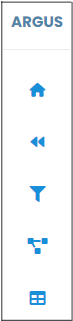
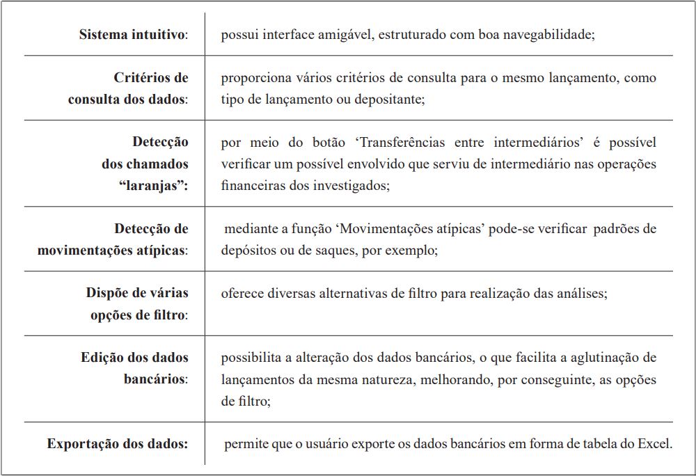

# ARGUS 

Módulo Análise

 
*Figura 1 - Tela do Módulo de Análise.*  

 O Sistema ARGUS – Módulo Análise é voltado para o cruzamento de informações obtidas por meio da quebra de sigilo bancário. Esse módulo auxilia os usuários responsáveis pela análise bancária ao processar dados transmitidos pelo SIMBA, apresentando-os em uma interface intuitiva. Essa simplificação dos dados acelera a análise e torna os procedimentos investigativos mais eficientes. 
 

####  Instrução - grupo de ícones 

 
*Figura x - Grupo de ícones do canto superior esquerdo da tela.*  

Todas as telas do módulo de análise ostentarão, no canto superior esquerdo, este grupo de ícones (Figura x), onde: 

--- Inserir aqui 
 

####  Principais facilidades do Argus Análise  

 
*Figura x - Facilidades do Argus Análise.*   